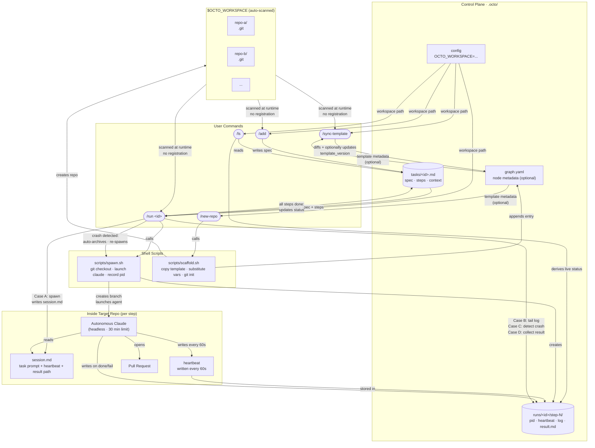
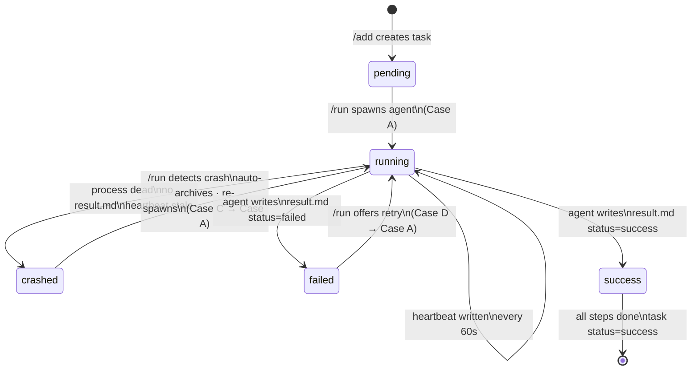
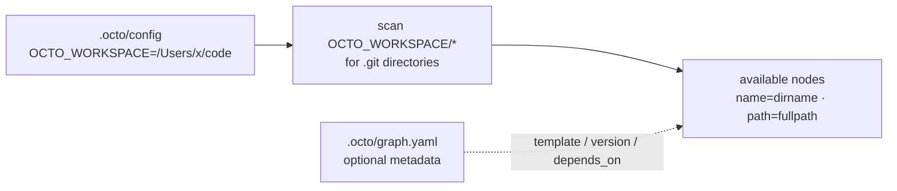

# Octo System Architecture

High-level skill interaction diagram showing how the five orchestration skills relate to each other, shared data stores, and autonomous agent sessions.

## Lifecycle State Machine (per step)

## Data Flow Summary

| Phase | Actor | What changes |
| ----- | ----- | ------------ |
| **Queue** | `/add` | New `.octo/tasks/<id>.md` created (`status: pending`) |
| **Spawn** | `/run` Case A | `session.md` written to repo; branch created; agent launched; `pid` recorded |
| **Execute** | Autonomous Claude | Code committed; PR opened; `heartbeat` written every 60s; `result.md` written on done |
| **Monitor** | `/run` Case B | Reads `pid` liveness + heartbeat age; no writes |
| **Crash recovery** | `/run` Case C | Crashed run archived; fresh run spawned automatically |
| **Collect** | `/run` Case D | `result.md` parsed; task advances to next step or `status: success` |
| **Scaffold** | `/new-repo` | Template copied; git init; entry added to `graph.yaml`; auto-discovered thereafter |
| **Drift check** | `/sync-template` | Template diff shown; agent-setup files optionally overwritten; version bumped in `graph.yaml` |

## Discovery: No Registration Required

Any repo created under `$OCTO_WORKSPACE` is immediately available to `/add`, `/run`, and `/sync-template` — no manual registration step, no drift between disk and config.
